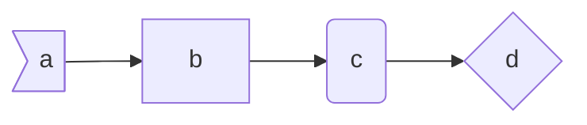

# Markdown Reference

How to write up Markdown documents.

There are two extensions that great

## Basic Markdown

[Markdown Syntax](https://www.markdownguide.org/basic-syntax)

## Markdown + Math

[Latex Math Syntax](https://en.wikibooks.org/wiki/LaTeX/Mathematics)

Extension

> goessner.mdmath

Examples

Greek Letters

$$\alpha \beta \gamma \epsilon$$

Fractions

$$\frac{A}{B}$$

Powers

$$A^B$$

Subscript

$$A_{subscript}$$

Logic

$$ \forall \equiv \quad \exists \in \leq  \geq$$

Inline Math Equations $\alpha^2 + \beta^2 = \gamma^2$ also work.

## Mermaid

[Mermaid Syntax](https://mermaidjs.github.io/)

Extension

> bierner.markdown-mermaid

Examples

Simple diagram

Example with labels and styling

```mermaid
graph LR
    on((Light On))
    off((Light Off))

    classDef onStyle fill:#fff,stroke:#333,stroke-width:2px;
    class on onStyle

    classDef offStyle fill:#000,stroke:#333,stroke-width:2px;
    class off offStyle

    on -- click --> off
    off --click --> on
```

